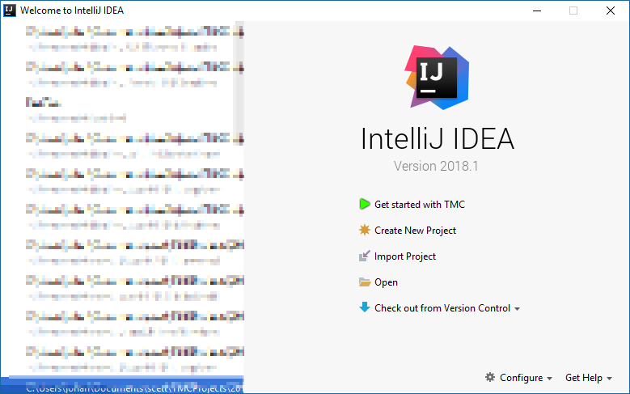
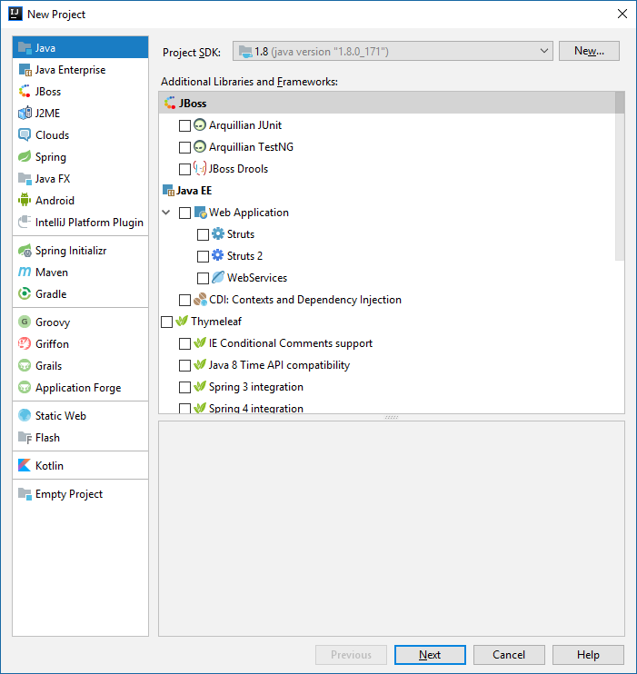
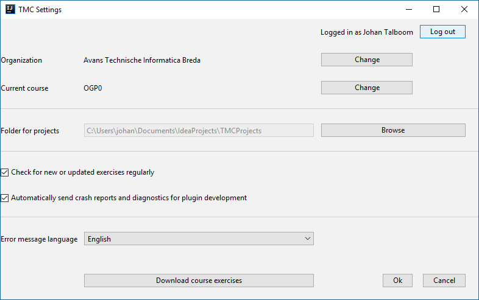
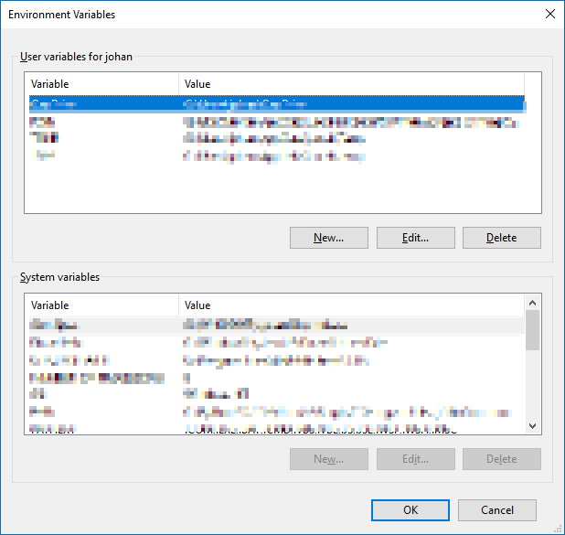
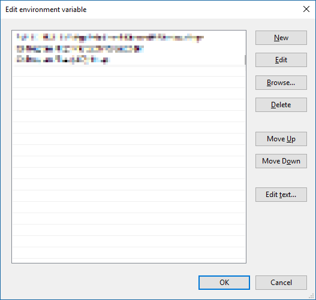

## IntelliJ

### JDK

To start programming in java, the first step is to download the Java SE Development Kit (JDK). You can find this at the [java](http://www.oracle.com/technetwork/java/javase/downloads/jdk8-downloads-2133151.html) website. Make sure you accept the licence agreement, and download the version for your platform. SE is the Standard Edition. Java also comes in an Enterprise Edition (Java EE), and a micro edition (Java ME).

**Note**: it is possible to install both 32bit and 64bit JDKs on a 64bit Windows machine. The **64bit** JDK is recommended, but some libraries are only available in 32bit, and require the 32bit version, so this can be installed next to the 64bit version.

### IntelliJ

To program in Java we'll use the IntelliJ IDEA, Community edition. This can be found at [the jetbrains website](https://www.jetbrains.com/idea/download/#section=windows). It's also possible to use the ultimate edition, a licence is available at https://www.jetbrains.com/student/, free for students. We won't be using any ultimate features through the course though

### Configure JDK in IntelliJ

After installing IntelliJ and starting it, the first thing you'll need to do is set up a number of extra features. Just leave these on the default settings and click the button to use the default. After starting up IntelliJ you'll get the startup window. 

In this window, click 'create new project' to create a new window.

The first time in this window, the JDK needs to be setup. This is done with the new button at the top of the window, and selecting your JDK. This is usually found in `c:\Program Files\java\jdk1.8.0_xxx` (where xxx is the version number, 172 at the time of writing). After selecting the Java JDK, press the 'next' button on the create new project screen to get into the main screen, where we can install the TMC plugin to work on the exercises presented in this course. Open the Settings window through the file -> settings menu, go to the plugins page and click the "Browse Repositories" button. Then search for TMC and install the TMC Plugin for IntelliJ. The plugin will be enabled after restarting IntelliJ

### TMC in Java

After installing, you will be presented with the TMC login. Login with your [TMC](https://tmc.mooc.fi) login information. Then select the right organization (2017_avans_ti_breda), and pick the subject. Make sure this is set up in the settings properly

After you're logged in you can download the TMC exercises through the TMC menu, by clicking "Download current course's ALL exercises". After downloading, open the TMC exercise list, doubleclick an exercise and you're ready to go. You can find the sourcecode to work on in the project's "src" folder.

#### Configure JDK for TMC in IntelliJ

To test code using the TMC tests, java has to be added to the system path, so 'javac' can be found. If this is not in the path, you will have to add this manually. In order to add this manually, follow the following steps (windows 10)

- Press the windows key, and type `Edit environment variables for your account`. A popup should appear to edit the environment variables
  
- In this window, in the User variables section, doubleclick the path item (or add a new one if it's not there), and a new window will pop up to edit the path variable  
  
- Add the path to your java JDK's bin directory. This would be `C:\Program Files\Java\jdk1.8.0_172\bin` for a default java installation, at the time of writing. Please note the version number you're using
- Press Ok, and restart IntelliJ

---

## IntelliJ features

IntelliJ is a complete working enironment for working with java and contains a lot of advanced features, like autocompletion, refactoring code and a step-by-step debugger. This FAQ will give you some lighlights

### Automatic code formatting

To format your code, hit *Ctrl*{: .key} + *Alt*{: .key} + *L*{: .key}  
This will format your code to the currently set coding standard. IntelliJ will

* Set curly brackets { and } on the proper lines
* Fix indention
* Fix spaces and tabs
* Remove extra empty lines

It is possible to configure the way IntelliJ reformats your code, this is done in the settings menu (File-Settings or *Ctrl*{: .key} + *Alt*{: .key} + *S*{: .key}), on the Editor - Code Style - Java page.

### Automatic error solution suggestions

Sometimes during programming, some errors come up. IntelliJ can fix a lot of these problems by pressing *Alt*{: .key} + *Enter*{: .key}. A small list will popup with suggestions by IntelliJ to correct the error. This can be used for

* Adding missing imports
* Create non-existing methods or constructors
* Change method parameters

### Autocompletion

Autocompletion is often triggered automatically. When it isn't triggered, you can open it with *Ctrl*{: .key} + *Space*{: .key}

### Parameter lookup

To see the parameters in a function, use *Ctrl*{: .key} + *P*{: .key}. This allows you to easily see what parameters to fill into a function

### Creating constructors, getters and setters

By pressing *Alt*{: .key} + *Insert*{: .key}, you'll open the *Generate* menu. In this menu you can pick constructor, getter, setter or override methods. After this a small window pops up where details can be configured, like which parameters to add to the constructor (based on attributes), or what getters and setters to generate.

### Renaming

Methods, attributes, variables and classes can be renamed, where all references are also renamed. This can be done through the refactor - rename option, or by pressing *Shift*{: .key} + *F6*{: .key}

### Commenting

You can quickly comment and uncomment multiple lines by selecting the lines you want to comment, and pressing *Ctrl*{: .key} + */*{: .key}

### Indenting

You can quickly indent multiple lines of code by selecting the lines you want to move left or right, and pressing *Tab*{: .key} to move the lines right, or *Shift*{: .key} + *Tab*{: .key} to move the lines left

