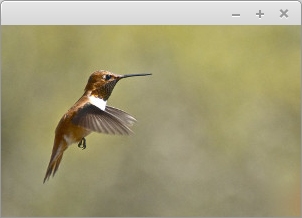
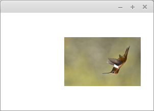
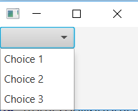
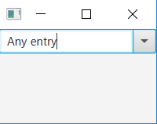
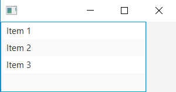
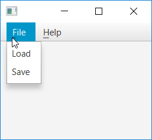
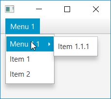
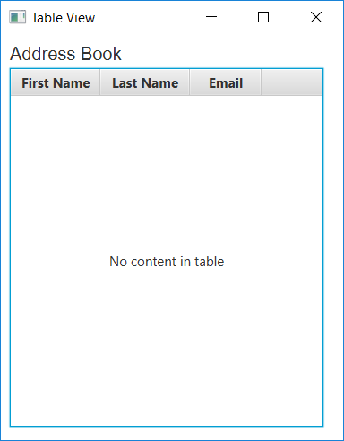
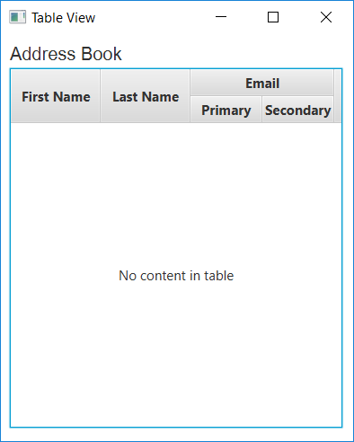
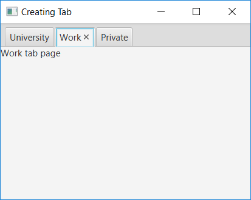


---

## Other basic components

Last week we have seen some basic JavaFX controls such as `Button`, `Label` and `TextField`. There are many more basic UI controls. In this chapter we will explain a few of them.

### RadioButtons

A [`RadioButton`](https://docs.oracle.com/javase/8/javafx/api/javafx/scene/control/RadioButton.html) is a button that can be selected or not selected. The `RadioButton` cannot be "deselected" once it's selected. To deselect it, select another radiobutton in the same radiobutton group

You create a `RadioButton` using its constructor. Here is a `RadioButton` instantiation example:

```java
RadioButton teacherRadioButton = new RadioButton("Teacher");
```

The `String` passed as parameter to the `RadioButton` constructor is displayed next to the `RadioButton`.

To make a `RadioButton` visible you must add it to the scene graph of your application. This means adding the `RadioButton` to a `Scene`, or as child of a layout which is attached to a `Scene` object.

Here is an example that attaches a `RadioButton` to the scene:

```java
public void start(Stage stage) {
    RadioButton teacherRadioButton = new RadioButton("Teacher");

    HBox hbox = new HBox(teacherRadioButton);

    Scene scene = new Scene(hbox, 200, 100);
    stage.setScene(scene);
    stage.show();
}
```

The application resulting from running this example looks like this:


The `RadioButton` class has a method named `isSelected` which lets you determine if the `RadioButton` is selected or not. The `isSelected` method returns a boolean with the value true if the `RadioButton` is selected, and false if not. Here is an example:

```java
boolean isSelected = teacherRadioButton.isSelected();
```

#### Combining RadioButtons in groups

Radio buttons are typically used in a group to present several mutually exclusive options. Groups are defined by using the object [`ToggleGroup`](https://docs.oracle.com/javase/8/javafx/api/javafx/scene/control/ToggleGroup.html) from the JavaFX library. When `ToggleGroup` is used, only one radio button inside the group can be selected.

In the example above we create two groups of RadioButtons in order to have two inputs. The following code is used

```java
public void start(Stage stage) {

    // Position section
    ToggleGroup positionToggleGroup = new ToggleGroup();
    Label positionLabel = new Label("Position:");

    RadioButton teacherRB = new RadioButton("Teacher");
    teacherRB.setToggleGroup(positionToggleGroup);
    teacherRB.setSelected(true);

    RadioButton assistantRB = new RadioButton("Assistant");
    assistantRB.setToggleGroup(positionToggleGroup);

    RadioButton studentRB = new RadioButton("Student");
    studentRB.setToggleGroup(positionToggleGroup);

    VBox positionVBox = new VBox();
    positionVBox.getChildren().addAll(positionLabel, teacherRB, assistantRB, studentRB);

    // Study section
    ToggleGroup studyToggleGroup = new ToggleGroup();
    Label studyLabel = new Label("Study:");

    RadioButton compEngRB = new RadioButton("Computer Engineering");
    compEngRB.setToggleGroup(studyToggleGroup);
    compEngRB.setSelected(true);

    RadioButton computerScienceRB = new RadioButton("Computer Science");
    computerScienceRB.setToggleGroup(studyToggleGroup);

    VBox studyVBox = new VBox();
    studyVBox.getChildren().addAll(studyLabel, compEngRB, computerScienceRB);

    // Add everything towards the UI
    BorderPane borderPane = new BorderPane();
    HBox hBox = new HBox();
    hBox.getChildren().addAll(positionVBox, studyVBox);
    borderPane.setCenter(hBox);

    Scene firstScene = new Scene(borderPane);
    stage.setScene(firstScene);
    stage.show();
}
```

The application resulting from running this example looks like this:


The selected radio button can be found by using the method `isSelected` on the object `RadioButton`, which returns a `Boolean` value, or the selected object `RadioButton` can be found using the method `getSelectedToggle` on the object `ToggleGroup`. If no RadioButton is selected the `getSelectedToggle` method returns null .

```java
RadioButton selectedGroup = (RadioButton)studyToggleGroup.getSelectedToggle();
System.out.println(selectedGroup.getText());
```

It's also possible to add `EventHandler` to see if the selection is changed like in the example below, which displays a pop-up when *Computer Engineering* is selected.

```java
compEngRB.setOnAction(e -> {
    if (compEngRB.isSelected()) {
        new Alert(Alert.AlertType.INFORMATION, "TI 4 all!", ButtonType.OK).show();
    }
});
```

But sometimes it is more convenient to create an `EventHandler` on the `ToggleGroup`. This allows you to only create one `EventHandler` for the `ToggleGroup`. You can implement it using the following code

```java
studyToggleGroup.selectedToggleProperty().addListener(
                (ov, old_toggle, new_toggle) -> {
                    if (studyToggleGroup.getSelectedToggle() != null) {
                        String text = ((RadioButton)studyToggleGroup.getSelectedToggle()).getText();
                    }
                });
```


{: .exercises }

### CheckBoxes

A [`CheckBox`](https://docs.oracle.com/javase/8/javafx/api/javafx/scene/control/CheckBox.html) is a button which can be in two different states: *Selected and not selected*. The `CheckBox` control is represented by the class `javafx.scene.control.CheckBox`.

You create a `CheckBox` control via the `CheckBox` constructor. Here is a `CheckBox` instantiation example:

```java
CheckBox greenCheckBox = new CheckBox("Green");
```

The `String` passed to the `CheckBox` constructor is displayed next to the `CheckBox` control.

To make a `CheckBox` control visible you must add it to the scene graph of your application. That means adding the `CheckBox` control to a `Scene` object, or to some layout component which is itself added to a `Scene` object.

Here is an example showing how to add a `CheckBox` to the scene graph:

```java
public void start(Stage stage) {

    // Checkboxes
    Label examLabel = new Label("Selected exams:");
    CheckBox ogp1CheckBox = new CheckBox("OGP-1");
    CheckBox hwiCheckbox = new CheckBox("Hardware interfacing");
    CheckBox wiskundeCheckBox = new CheckBox("Wiskunde");

    VBox selectedCourse = new VBox();
    selectedCourse.getChildren().addAll(examLabel, ogp1CheckBox, hwiCheckbox, wiskundeCheckBox);

    Scene firstScene = new Scene(selectedCourse);
    stage.setScene(firstScene);
    stage.show();
}
```

The application resulting from running this code looks like this:


The method `isSelected` can be used to check if the Checkbox is selected. It's also possible to add `EventHandler` to see if the selection is changed like in the example below

```java
wiskundeCheckBox.setOnAction(e -> {
    if (wiskundeCheckBox.isSelected()) {
        new Alert(Alert.AlertType.INFORMATION, "Math 4 all!", ButtonType.OK).show();
    }
});
```


### Pictures

There are several ways to display an image inside a Java application. One straightforward approach used JavaFx's the class [Image](https://docs.oracle.com/javafx/2/api/javafx/scene/image/Image.html) and the class [ImageView](https://docs.oracle.com/javase/8/javafx/api/javafx/scene/image/ImageView.html).

The parameter given to Image class is the name of the image file to be opened. The name should start with the prefix *file:*, this means the image is a file. In the example below, the file *humming.jpg*  is given as parameter towards the `ImageView`. Then the `ImageView` object is placed in the `Layout`. The layout is placed into the Scene Object and placed inside the view.

```java
import javafx.application.Application;
import static javafx.application.Application.launch;
import javafx.scene.Scene;
import javafx.scene.image.Image;
import javafx.scene.image.ImageView;
import javafx.scene.layout.Pane;
import javafx.stage.Stage;

public class ImageApplication extends Application {

    @Override
    public void start(Stage stage) {

        Image image = new Image("file:humming.jpg");
        ImageView imageView = new ImageView(image);

        Pane pane = new Pane();
        pane.getChildren().add(imageView);

        stage.setScene(new Scene(pane));
        stage.show();

    }

    public static void main(String[] args) {
        launch(args);
    }
}
```

Executing a program creates the following window. It is assumed that the file *humming.jpg* exists and is found at the root of the project (from the same folder as the file pom.xml).



The example uses the picture [Linda Tanner](https://www.flickr.com/photos/15323831@N05) available at [http://www.freestockphotos.biz/stockphoto/17874](http://www.freestockphotos.biz/stockphoto/17874). Image is licensed under the Creative Commons CC BY 2.0 license.


#### Simple image processing

The class `ImageView` provides a set of methods for image (simple processing). In other words, the image can be rotated, its size can be changed and it can be moved on the screen. In the example below, the picture is rotated around, its size is halved and moved slightly to the right.

```java
@Override
public void start(Stage stage) {

    Image image = new Image("file:humming.jpg");
    ImageView imageView = new ImageView(image);
  
    imageView.setRotate(180);
    imageView.setScaleX(0.5);
    imageView.setScaleY(0.5);
  
    imageView.setTranslateX(50);

    Pane pane = new Pane();
    pane.getChildren().add(imageView);

    stage.setScene(new Scene(ruutu));
    stage.show();
}
```




{: .exercises }


### ComboBox

The [`ComboBox`](https://docs.oracle.com/javase/8/javafx/api/javafx/scene/control/ComboBox.html) control enables users to choose an option from a predefined list of choices, or type in another value if none of the predefined choices matches what the user wants to select. The `ComboBox` control is represented by the class `javafx.scene.control.ComboBox`. 

You create a `ComboBox` simply by creating a new instance of the `ComboBox` class. Here is a `ComboBox` instantiation example:

```java
ComboBox comboBox = new ComboBox();
```

You can add choices to a `ComboBox` by obtaining its item collection and add items to it. Here is an example that adds choices to a  `ComboBox`:

```java
comboBox.getItems().add("Choice 1");
comboBox.getItems().add("Choice 2");
comboBox.getItems().add("Choice 3");
```

To make a `ComboBox` visible you must add it to the scene. This means that you must add the `ComboBox` to a `Scene` object or to some layout component which is then attached to the `Scene` object.

Here is an example showing how to add a `ComboBox` to the scene:

```java
public void start(Stage stage) {
    ComboBox comboBox = new ComboBox();

    comboBox.getItems().add("Choice 1");
    comboBox.getItems().add("Choice 2");
    comboBox.getItems().add("Choice 3");

    HBox hbox = new HBox(comboBox);

    Scene scene = new Scene(hbox, 200, 120);
    stage.setScene(scene);
    stage.show();
}
```

The application resulting from running this example would look similar to this:



You can read the selected value of a `ComboBox` via its `getValue` method. If no choice is selected, the `getValue` method returns null. Here is an example of calling `getValue`:

```java
String value = (String) comboBox.getValue();
```

A `ComboBox` is not editable by default. That means, that by default the user cannot enter anything themselves, but only choose from the predefined list of options. To make a `ComboBox` editable you must call the `setEditable` method of the `ComboBox`. Here is an example making a `ComboBox` editable:

```java
comboBox.setEditable(true);
```

Once the `ComboBox` is editable the user can type in values into the `ComboBox`. The entered value is also read via the `getValue` method as explained earlier. The following screenthot shows a `ComboBox` which is editable, and with a custom value entered:




### ListView

The [`ListView`](https://docs.oracle.com/javase/8/javafx/api/javafx/scene/control/ListView.html) control enables users to choose one or more options from a predefined list of choices. The `ListView` control is represented by the class `javafx.scene.control.ListView`.

You create a `ListView` simply by creating a new instance of the `ListView` class. Here is a `ListView` instantiation example:

```java
ListView listView = new ListView();
```

You can add items (options) to a `ListView` by obtaining its item collection and add items to it. Here is an example that adds items to a `ListView`:

```java
listView.getItems().add("Item 1");
listView.getItems().add("Item 2");
listView.getItems().add("Item 3");
```

To make a `ListView` visible you must add it to the `scene`. This means that you must add the `ListView` to a `Scene` object or to some layout component which is then attached to the `Scene` object.

Here is an example showing how to add a `ListView` to the scene:

```java
public void start(Stage stage)  {
    ListView listView = new ListView();

    listView.getItems().add("Item 1");
    listView.getItems().add("Item 2");
    listView.getItems().add("Item 3");

    HBox hbox = new HBox(listView);

    Scene scene = new Scene(hbox, 300, 120);
    stage.setScene(scene);
    stage.show();
}
```

The application resulting from running this example would look similar to this screenshot:



Like we noticed inside ComboBoxes, it's recommened to use an `OberservableList` when items can be changed.

Notice how the `ListView` shows multiple options by default. You can set a height and width for a `ListView`, but you cannot set explicitly how many items should be visible. The height determines that based on the height of each item displayed.

If there are more items in the `ListView` than can fit into its visiible area, the `ListView` will add scroll bars so the user can scroll up and down over the items.

You can read the selected indexes of a `ListView` via its `SelectionModel`. Here is an example showing how to read the selected indexes of a `ListView`:

```java
ObservableList selectedIndices = listView.getSelectionModel().getSelectedIndices();
```

The `OberservableList` will contain `Integer` objects representing the indexes of the selected items in the `ListView`.

Here is a full example with a button added which reads the selected items of the `ListView` when clicked:

```java
import javafx.application.Application;
import javafx.collections.ObservableList;
import javafx.scene.Scene;
import javafx.scene.control.Button;
import javafx.scene.control.ListView;
import javafx.scene.control.SelectionMode;
import javafx.scene.layout.VBox;
import javafx.stage.Stage;


public class ListViewExperiments extends Application  {


    @Override
    public void start(Stage stage)  {
        ListView listView = new ListView();
        listView.getItems().add("Item 1");
        listView.getItems().add("Item 2");
        listView.getItems().add("Item 3");

        Button button = new Button("Read Selected Value");

        button.setOnAction(event -> {
            ObservableList selectedIndices = listView.getSelectionModel().getSelectedIndices();

            for(Object o : selectedIndices){
                System.out.println("o = " + o + " (" + o.getClass() + ")");
            }
        });

        VBox vBox = new VBox(listView, button);

        Scene scene = new Scene(vBox, 300, 120);
        stage.setScene(scene);
        stage.show();
    }

    public static void main(String[] args) {
        Application.launch(args);
    }
}
```

To allow multiple items in the `ListView` to be selected you need to set the corresponding selection mode on the `ListView` selection model. Here is an example of setting the selection mode on the `ListView`:

```java
listView.getSelectionModel().setSelectionMode(SelectionMode.MULTIPLE);
```

Once you have set the `SelectionMode.MULTIPLE` on the `ListView` selection model, the user can select multiple items in the `ListView` by holding down *SHIFT* or *CTRL* keys when selecting additional items after the first selected item.

Here is a full example that shows how to set a `ListView` into multiple selection mode, including a button which when clicked will write out the indices of the selected items in the `ListView`:

```java
import javafx.application.Application;
import javafx.collections.ObservableList;
import javafx.scene.Scene;
import javafx.scene.control.Button;
import javafx.scene.control.ListView;
import javafx.scene.control.SelectionMode;
import javafx.scene.layout.VBox;
import javafx.stage.Stage;


public class ListViewExperiments extends Application  {

    @Override
    public void start(Stage stage)  {
        ListView listView = new ListView();
        listView.getSelectionModel().setSelectionMode(SelectionMode.MULTIPLE);
        listView.getItems().add("Item 1");
        listView.getItems().add("Item 2");
        listView.getItems().add("Item 3");

        Button button = new Button("Read Selected Value");

        button.setOnAction(event -> {
            ObservableList selectedIndices = listView.getSelectionModel().getSelectedIndices();

            for(Object o : selectedIndices){
                System.out.println("o = " + o + " (" + o.getClass() + ")");
            }
        });

        VBox vBox = new VBox(listView, button);

        Scene scene = new Scene(vBox, 300, 120);
        stage.setScene(scene);
        stage.show();
    }

    public static void main(String[] args) {
        Application.launch(args);
    }
}
```

#### Working with ObservableList

JavaFX components do not store their data in normal ArrayLists internally, but in `ObservableList`. An ObservableList is similar to an `ArrayList` to store data, but it adds a feature where it is possible to get notified in code when the data changes. In JavaFX this is used to update the user interface components.

Fortunately, it is very easy to map an `ObservableList` to an `ArrayList`, using the `FXCollections` class.

```java
    ArrayList<String> myData = new ArrayList<>();
    ...
    studentList.setItems(FXCollections.observableList(myData));
```

The advantage of using this, is that you can use your own data classes (ArrayList of data), which is really easy to refresh into the user interface. An example of use would be

```java
public class ListDemo extends Application {

    private ArrayList<String> data;
    private int i;

    public ListDemo()
    {
        this.data = new ArrayList<String>();
        this.data.add("Item 1");
        this.data.add("Item 2");
        this.data.add("Item 3");
        this.i = 4;
    }


    @Override
    public void start(Stage stage) throws Exception {

        BorderPane main = new BorderPane();

        ListView<String> list = new ListView<String>();
        main.setCenter(list);

        HBox bottomBar = new HBox();
        main.setBottom(bottomBar);

        list.setItems(FXCollections.observableList(data));

        Button add = new Button("Add");
        bottomBar.getChildren().add(add);
        add.setOnAction(e -> {
            this.data.add("Item " + i);
            list.refresh();
            this.i++;
        });

        Button print = new Button("Print Console");
        bottomBar.getChildren().add(print);
        print.setOnAction(e -> {
            System.out.println(this.data);
        });

        stage.setScene(new Scene(main));
        stage.show();
    }

    public static void main(String[] args) {
        launch(ListDemo.class);
    }
}

```

In this example, when we click the 'add' button, a new item gets added to the `ArrayList`. To update the list, just call the `list.refresh()` method to update the user interface to represent the new data. The beauty is that the user interface and your own data classes are automatically in sync, so you do not have to add items to the `ListView` and your own data class seperately, and you do not have to read out the values of the list to get data. This is a good example of seperating data and logic as discussed last week. This technique also works for `ComboBox`


{: .exercises }

### MenuBar

The [`MenuBar`](https://docs.oracle.com/javase/8/javafx/api/javafx/scene/control/MenuBar.html) provides applications with a visual drop down menu similar to that most desktop applications have at the top of their application window. The `MenuBar` is represented by the class `javafx.scene.control.MenuBar`. Here is an example screenshot of what a  `MenuBar` can look like:



Before you can use the `MenuBar` you must create a `MenuBar` instance. Here is an example of creating a `MenuBar` instance:

```java
MenuBar menuBar = new MenuBar();
```

Before a `MenuBar` becomes visible you will have to add it to the scene. Here is an example of adding a `MenuBar` to the scene graph:

```java
public void start(Stage stage) {
    MenuBar menuBar = new MenuBar();

    VBox vBox = new VBox(menuBar);
    Scene scene = new Scene(vBox, 960, 600);

    stage.setScene(scene);
    stage.show();
}
```

Notice how the `MenuBar` is added to the root layout (`VBox`) of the scene. This places the `MenuBar` at the top of the application window.

Note that the above example does not add any menus or menu items to the `MenuBar`, so if you run the example you will not actually see the `MenuBar`. We will see how to add menus and menu items in the following sections.

Once the `MenuBar` instance is created, you can add [`Menu`](https://docs.oracle.com/javase/8/javafx/api/javafx/scene/control/Menu.html) instances to it. A `Menu` instance represents a single vertical menu with nested menu items. Thus, you can add multiple `Menu` instances to a `MenuBar` to add multiple vertical drop down menus.

```java
Menu menu1 = new Menu("Menu 1");
MenuBar menuBar = new MenuBar();
menuBar.getMenus().add(menu1);
```

Here is a screenshot showing the `MenuBar` as configured by the example code above:

As you can see, there is only a single menu in the `MenuBar` titled *Menu 1*. This menu has no menu items nested under it. Once you have created a `Menu` instance you must add one or more `MenuItem` instances to it. Each `MenuItem` corresponds to a menu item in the menu it is added to. Here is an example of adding 2 `MenuItem` instances to a `Menu`, which is then added to a `MenuBar`:

```java
Menu menu = new Menu("Menu 1");
MenuItem menuItem1 = new MenuItem("Item 1");
MenuItem menuItem2 = new MenuItem("Item 2");

menu.getItems().add(menuItem1);
menu.getItems().add(menuItem2);

MenuBar menuBar = new MenuBar();
menuBar.getMenus().add(menu);
```

The `MenuBar` configurations created in the previous examples do not react if you select any of the menu items. In order to respond to the selection of a `MenuItem` you must set an event listener on the `MenuItem`. Here is an example of adding an event listener to a `MenuItem`:

```java
MenuItem menuItem1 = new MenuItem("Item 1");

menuItem1.setOnAction(e -> {
    System.out.println("Menu Item 1 Selected");
});
```

#### Sub menus

The `MenuBar` supports multiple layers of menus. A menu nested inside another menu is called a submenu. The `Menu` class extends the `MenuItem` class and can therefore be used as a menu item inside another `Menu` instance. Here is an example that creates a single menu with a submenu inside:

```java
Menu menu = new Menu("Menu 1");

Menu subMenu = new Menu("Menu 1.1");
MenuItem menuItem11 = new MenuItem("Item 1.1.1");
subMenu.getItems().add(menuItem11);
menu.getItems().add(subMenu);

MenuItem menuItem1 = new MenuItem("Item 1");
menu.getItems().add(menuItem1);

MenuItem menuItem2 = new MenuItem("Item 2");
menu.getItems().add(menuItem2);

MenuBar menuBar = new MenuBar();
menuBar.getMenus().add(menu);
```

The `MenuBar` resulting from the above example will look similar to this:




### TableView

The [`TableView`](https://docs.oracle.com/javase/8/javafx/api/javafx/scene/control/TableView.html) control enables users to create a Table of multiple rows and column. The `TableView` control is represented by the class `javafx.scene.control.TableView`. The vertical items are called columns and are represented by the JavaFX control [`TableColumn`](https://docs.oracle.com/javase/8/javafx/api/javafx/scene/control/TableColumn.html), the horizontal lines are called rows and are represented by the JavaFX control [`TableRow`](https://docs.oracle.com/javase/8/javafx/api/javafx/scene/control/TableRow.html). The `TableView` component can be usefull to display multiple object with multiple values, such as an address book.

#### Defining a TableView

In this chapter we are creating an address book using the `TableView`



The screen capture is created using the following code:

```java
private TableView table = new TableView();

    @Override
    public void start(Stage stage)  {
        Scene scene = new Scene(new Group());
        stage.setTitle("Table View");
        stage.setWidth(400);
        table.setPrefWidth(350);
        stage.setHeight(500);

        Label label = new Label("Address Book");
        label.setFont(new Font("Arial", 20));

        table.setEditable(true);

        TableColumn firstNameCol = new TableColumn("First Name");
        firstNameCol.setPrefWidth(100);
        TableColumn lastNameCol = new TableColumn("Last Name");
        lastNameCol.setPrefWidth(100);
        TableColumn emailCol = new TableColumn("Email");

        table.getColumns().addAll(firstNameCol, lastNameCol, emailCol);

        VBox vbox = new VBox();
        vbox.setSpacing(5);
        vbox.setPadding(new Insets(10, 0, 0, 10));
        vbox.getChildren().addAll(label, table);

        ((Group) scene.getRoot()).getChildren().addAll(vbox);

        stage.setScene(scene);
        stage.show();
    }
```

The table control is created by instantiating the class `TableView`. In the example it is added to the VBox layout container, however, you can add it directly to the application scene.
The example defines three columns to store the following information in an address book: a contact's *first name* and *last name*, and an *email address*. The columns are created by using the class `TableColumn`.
The `getColumns` method of the class `TableView`  adds the previously created columns to the table. In your applications, you can use this method to dynamically add and remove columns.

You can manage visibility of the columns by calling the method `setVisible`. For example, if the logic of your application requires hiding user email addresses, you can implement this task as follows: 

```java
emailCol.setVisible(false)
```

When the structure of your data requires a more complicated representation, you can create nested columns.

For example, suppose that the contacts in the address book have two email accounts. Then you need two columns to show the primary and the secondary email addresses. Create two subcolumns, and call the method `getColumns` on the object `emailCol` as shown in the example.

```java
TableColumn firstEmailCol = new TableColumn("Primary");
TableColumn secondEmailCol = new TableColumn("Secondary");

emailCol.getColumns().addAll(firstEmailCol, secondEmailCol);
```

After you have added these lines to code, and compiled and run the application code, the table appears as shown in the figure down here.



Although the table is added to the application, the standard caption *No content in table* appears, because no data is defined. Instead of showing this caption, you can use the method `setPlaceholder` to specify a `Node` object to appear in an empty table.

#### Data Model

When you create a table in a JavaFX application, it is a best practice to implement a class that defines the data model and provides methods and fields to further work with the table. The following code creates the Person class to define data in an address book.

```java
public class Person {
    private SimpleStringProperty firstName;
    private SimpleStringProperty lastName;
    private SimpleStringProperty email;

    public Person(String firstName, String lastName, String email) {
        this.firstName = new SimpleStringProperty(firstName);
        this.lastName = new SimpleStringProperty(lastName);
        this.email = new SimpleStringProperty(email);
    }

    public String getFirstName() {
        this.return firstName.get();
    }

    public void setFirstName(String firstName) {
        this.firstName.set(firstName);
    }

    public String getLastName() {
        return this.lastName.get();
    }

    public void setLastName(String lastName) {
        this.lastName.set(lastName);
    }

    public String getEmail() {
        return this.email.get();
    }

    public void setEmail(String email) {
        this.email.set(email);
    }
}
```

### TabPane

Tabs are very useful components to split a single screen into multiple pages. This functionallity is provided using the class [`Tab`](https://docs.oracle.com/javase/8/javafx/api/javafx/scene/control/Tab.html) which represent a tabpage and the tab control class [`TabPane`](https://docs.oracle.com/javase/8/javafx/api/javafx/scene/control/TabPane.html)



The following code is used to create the example above:

```java
@Override
    public void start(Stage stage)  {
        stage.setTitle("Creating Tab");

        TabPane tabpane = new TabPane();

        // create multiple tabs
        Tab universityTab = new Tab("University");
        Label universityLabel = new Label("University tab page");
        universityTab.setContent(universityLabel);

        Tab workTab = new Tab("Work");
        Label workLabel = new Label("Work tab page");
        workTab.setContent(workLabel);

        Tab privateTab = new Tab("Private");
        Label privateLabel = new Label("Private tab page");
        privateTab.setContent(privateLabel);

        tabpane.getTabs().addAll(universityTab, workTab, privateTab);

        Scene scene = new Scene(tabpane, 600, 500);
        stage.setScene(scene);
        stage.show();
    }
```

In the example above we first create the Tab control using the class `TabPane`, after that we create three tabpages using the class `Tab` and add all the tabs to the tab control, using the code `tabpane.getTabs().addAll(universityTab, workTab, privateTab);`.

The context of each tab page is set using the method `setContent`. The content can be a single UI control or a layout manager with multiple controls.



{: .exercises }